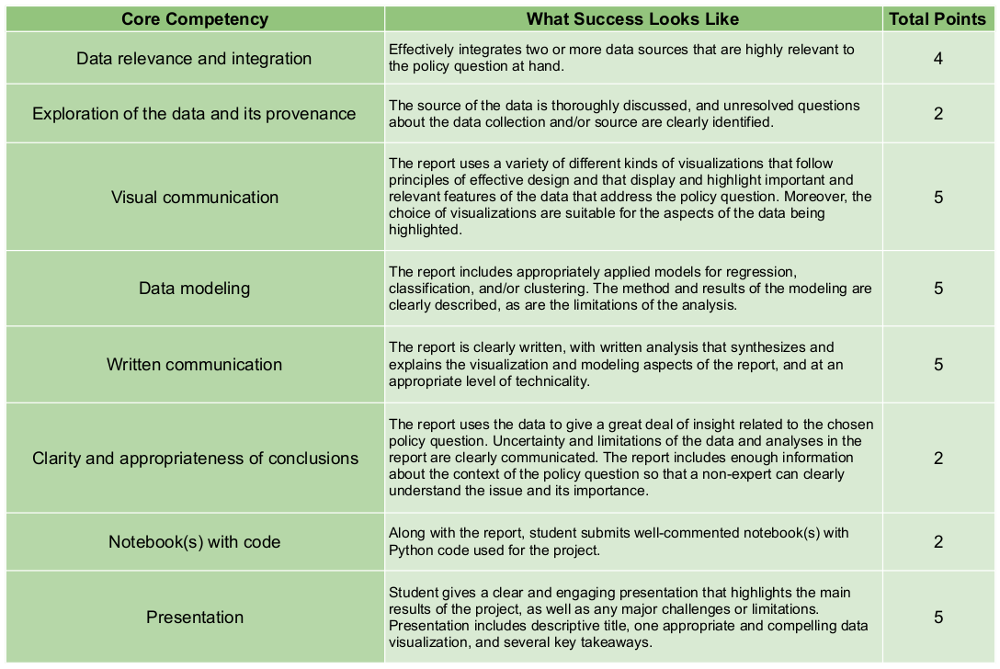

# Data Science for Global Applications

_This course material was originally prepared by [Anna Haensch](https://annahaensch.com/) and [Karin Knudson](https://karinknudson.com/) for Data Science for Global Applications taught at the Fletcher Graduate School of Global Affairs at Tufts University.  We wrote about some of our motivations and methodology for the 2022 SciPy Conference Proceedings in ["Python for Global Applications: teaching scientific Python in context to law and diplomacy students"](https://conference.scipy.org/proceedings/scipy2022/anna_haensch.html)_.

## Course Ouline

This course is designed for a 14 week semester with two 80 minute class meetings per week. Here we present the main topics for in-class discussion and groupwork as well as periodic assessemnts. 

## Weekly Planner

In what follows we provide a week-by-week plan including readings, journal prompts and assessments.

### Week 1

This week we will begin with the basics of Python.  

* Learning Objective: Students will learn the basics of Python variables using Google Colab Notebooks.
* In-Class Exerices: [Intro to Python Basics Workbook](https://colab.research.google.com/drive/1LOQ58TVwgSLHTadxWIcJXjtujXFJ1Ks0?usp=sharing)
* Assessment: None

### Week 2

### Week 3

### Week 4

### Week 5

### Week 6

### Week 7

### Week 8

### Week 9

### Week 10

### Week 11

### Week 12

### Week 13

### Week 14

