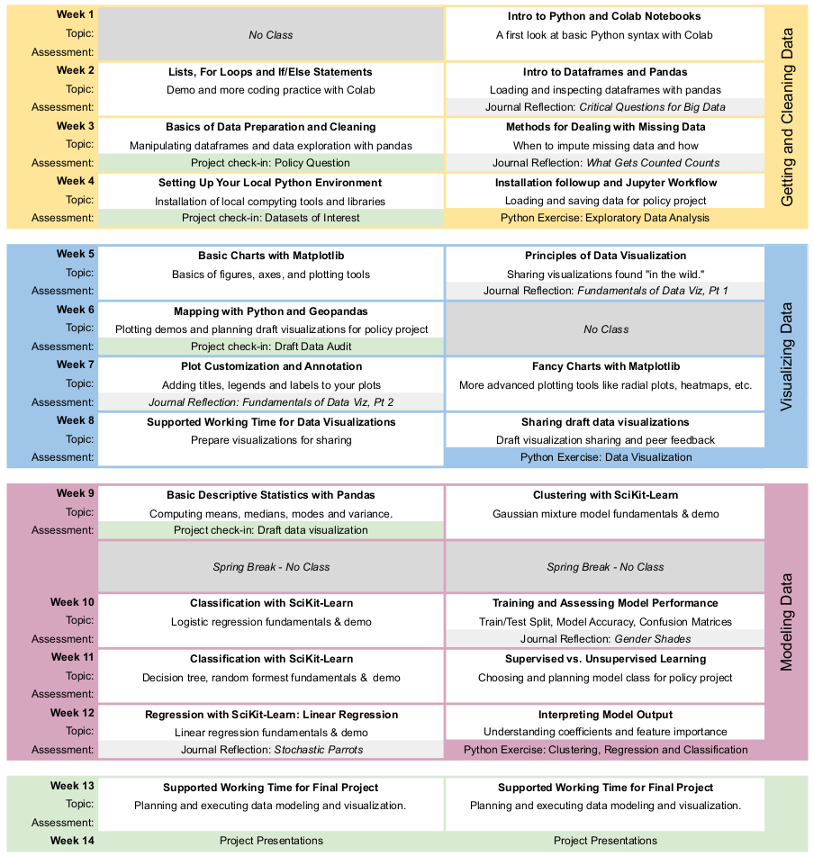

# Data Science for Global Applications

_This course material was originally prepared by [Anna Haensch](https://annahaensch.com/) and [Karin Knudson](https://karinknudson.com/) for Data Science for Global Applications taught at the Fletcher Graduate School of Global Affairs at Tufts University.  We wrote about some of our motivations and methodology for the 2022 SciPy Conference Proceedings in ["Python for Global Applications: teaching scientific Python in context to law and diplomacy students"](https://conference.scipy.org/proceedings/scipy2022/anna_haensch.html)_.

## Course Ouline

This course is designed for a 14 week semester with two 80 minute class meetings per week. Here we present the main ideas of each module and week of instruction. 

## Weekly Planner

In what follows we provide a week-by-week plan including learning objectives, suggested readings, benchmarks and assessments.

### Week 1

* Learning Objectives: 
  * Students will learn the basics of Python variables using Google Colab Notebooks.
* Suggested Reading: [d. boyd & K. Crawford, "Critical Questions for Big Data." (2012).](https://www.tandfonline.com/doi/full/10.1080/1369118X.2012.678878)
* In-Class Exercises: [Intro to Python Basics Workbook](https://colab.research.google.com/drive/1LOQ58TVwgSLHTadxWIcJXjtujXFJ1Ks0?usp=sharing)

### Week 2

* Learning Objectives: 
  * Students will learn how to execute for loops in Python.
  * Students will learn how to load and inspect data using pandas.
  * Students will be able to critique the assumptions and decisions that go into preliminary data acquisition and analysis, and be able to critique data collection methods (selection bias, etc.) 
* In-Class Exercises: [Intro to Dataframes Workbook]()
* Suggested Reading: [C. D’Ignazio & L. Klein, “4. What Gets Counted Counts.” In Data Feminism (2020).](https://data-feminism.mitpress.mit.edu/pub/h1w0nbqp)
* Project Benchmark: For your final project, you will be using data science to investigate a policy-related question. The goal of the project is for you to bring together the tools of data science that you will be learning about throughout the semester in order to shed light on a question that is of interest to you. For the project, you will need to find and explore relevant data sets, create illuminative data visualizations, and model how different variables of interest might relate to each other.  In this assignment, the goal is for you to generate three possible questions of interest, one of which you will pursue in detail for your final project. It is helpful to have several possible questions of interest, because for some questions it might be hard to find relevant datasets.  List your three questions. For each question, write down:
  * the question itself
  * a brief explanation of it that will help non-experts understand the question and why it is interesting or important
  * preliminary description of the kinds of data that would be helpful for investigating your question (note: you do not yet need to find data sources -- just think about what kind of data you would want). 
  
### Week 3
* Learning Objectives: 
  * Students will learn the basics of manipulating and exploring data with Python and pandas.
  * Students will learn how to assess, interogate, and mitigate the "missingness" of data and jsutify decisions regaring the same.
  * Students will be able to contexutalize data and the absence of data withing social, political, and economic contexts.
* In-Class Exercises: [Intro to Exploratory Data Analysis]()
* Suggested Reading:   [C. D’Ignazio & L. Klein, "6. The Numbers Don’t Speak for Themselves." In Data Feminism (2020).](https://data-feminism.mitpress.mit.edu/pub/czq9dfs5)

### Week 4
* Learning Objectives: 
  * Students will set up their local computing environment and develop comfort with command line prompts.
  * Students will begin to use Python in Jupyter Labs instead of Google Colab.
* In Class-Exercises:
* Suggested Reading: [T. Gillespie, "The Relevance of Algorithms." (2013).](https://www.microsoft.com/en-us/research/wp-content/uploads/2014/01/Gillespie_2014_The-Relevance-of-Algorithms.pdf)
* Project Benchmark: 
The goal of this check-in is to make progress on identifying several datasets that might be useful for your final project. You may want to re-read the final project rubric belown to keep in mind the expectations about what you will be creating.  For one (or two if you are having trouble deciding at this point) of the research questions that you suggested in your previous project check-in, do the following:
  * Identify at least two datasets that might be relevant to the question
  * Write a sentence or two about each of the datasets to explain what it is and why it might be useful to you (we will do a more extensive data audit later in the course).

### Week 5
* Learning Objectives: 
* In Class-Exercises:
* Suggested Reading: [C.O. Wilke, "Fundamentals of Data Visualization, Part I." (2019).](https://clauswilke.com/dataviz/)
* Project Benchmark: 

### Week 6
* Learning Objectives: 
* In Class-Exercises:
* Suggested Reading: [C. Weaver, "The Unmitigated Chaos of America’s Attempt at Color-Coded Covid Guidance" (2021)](https://www.nytimes.com/2021/04/02/style/coronavirus-safety-colors-states.html)
* Project Benchmark: 

### Week 7
* Learning Objectives: 
* In Class-Exercises:
* Suggested Reading: [C.O. Wilke, "Fundamentals of Data Visualization, Part II." (2019).](https://clauswilke.com/dataviz/)
* Project Benchmark: 

### Week 8
* Learning Objectives: 
* In Class-Exercises:
* Suggested Reading: [A. Cairo, "How Charts Lie, Ch. 1 & 2." (2019).](https://www.amazon.com/How-Charts-Lie-Getting-Information/dp/1324001569)
* Project Benchmark: 

### Week 9
* Learning Objectives: 
* In Class-Exercises:
* Suggested Reading: [FiveThirtyEight Staff, "Our 51 Best (And Weirdest) Charts Of 2021." (2021).](https://fivethirtyeight.com/features/our-51-best-and-weirdest-charts-of-2021/)
* Project Benchmark: 

### Week 10
* Learning Objectives: 
* In Class-Exercises:
* Suggested Reading: [L. Breiman, "Statistical Modeling: The Two Cultures." (2021).](http://www2.math.uu.se/~thulin/mm/breiman.pdf)
* Project Benchmark: 

### Week 11
* Learning Objectives: 
* In Class-Exercises:
* Suggested Reading:  [J. Buolamwini & T. Gebru, "Gender Shades: Intersectional Accuracy Disparities in Commercial Gender Classification." (2018).](https://proceedings.mlr.press/v81/buolamwini18a/buolamwini18a.pdf)
* Project Benchmark: 

### Week 12
* Learning Objectives: 
* In Class-Exercises:
* Suggested Reading: [J. Angwin, J. Larson, S. Mattu & L. Kirchner, "Machine Bias." (2016)](https://www.propublica.org/article/machine-bias-risk-assessments-in-criminal-sentencing)
* Project Benchmark: 

### Week 13
* Learning Objectives: 
* In Class-Exercises:
* Suggested Reading: [Z.C. Lipton, "The Mythos of Model Interpretability." (2026).](https://arxiv.org/pdf/1606.03490.pdf)
* Project Benchmark: 

### Week 14
* Learning Objectives: 
* In Class-Exercises:
* Suggested Reading:[E. Bender, T. Gebru, A. McMillan-Major & S. Shmitchell, "On the Dangers of Stochastic Parrots: Can Language Models Be Too Big? 🦜." (2021).](https://dl.acm.org/doi/10.1145/3442188.3445922)
* Project Benchmark: 

## The Policy Project 

